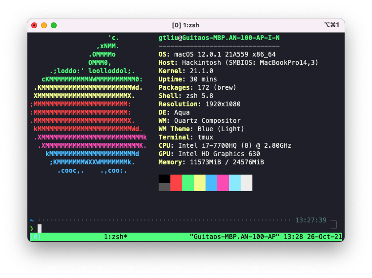

# MSI-GS63VR-Hackintosh

## Quick Start

If your laptop model is the same as mine, MSI GS63VR 7rf, the configuration works without modification. But you may need to change SMBIOS to enable iMessage and other Apple proprietary features. Windows dual system is enabled by default, please modify the config file and remove [EFI/Microsoft](EFI/Microsoft) if you don't need it.

The default setting is with cfg lock disabled. cfg lock could be easily disable in BIOS. Please enter BIOS and press R-CTRL, R-SHIFT, L-ALT and F2, and find cfg lock and Advanced -> Power & Performance -> CPU -> Power Management Control -> CPU Lock Configure. If you don't want to do this, enable Kernel -> Quirks -> AppleCpuPmCfgLock and Kernel -> Quirks -> AppleXcpmCfgLock.

## Devices

| Specifications      | Details                        |
| ------------------- | ------------------------------ |
| Computer Model      | MSI GS63VR 7rf                 |
| CPU                 | Intel Core i7-7700HQ           |
| Memory              | DDR4 2400Mhz. Upgrade to 24GiB |
| SATA SSD            | Samsung 860 EVO 500GiB         |
| Integrated Graphics | Intel HD Graphics 630          |
| Ethernet            | Killer E2500                   |
| Sound Card          | ALC899 Layout-id: 98           |
| Wireless Card       | DW1560 (Replaced)              |

## ScreenShots

## USB Mapping

USB mapping done with Hackintool, Thunderbolt 3 interface not included as Thunderbolt devices must be plugged in before booting up.

## Wireless Card

The origin wireless card is replaced with DW1560 for fully functional continuity features. If you prefer not to replace the card, please follow [OpenIntelWireless](https://github.com/OpenIntelWireless) project for wifi and bluetooth support, through which Handoff and Universal Clipboard would be the only supported features. 
